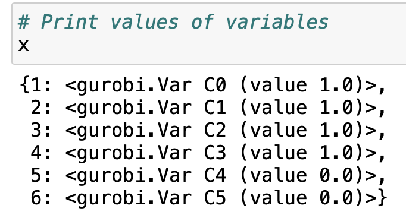

# Mixed-Integer-Optimisation
## Exercise Problem

An investor wants to invest 20 million USD and is considering 6 project candidates. Each project has an associated investment cost and net present value (NPV). The investor wants to select a portfolio of projects that maximizes the total NPV.

The project details are:

| Project | Investment (Mio USD) | NPV (Mio USD) |
| --- | --- | --- |
| 1 | 5 | 6 |
| 2 | 5 | 6 |  
| 3 | 5 | 6 |
| 4 | 5 | 6 |
| 5 | 8 | 10 |
| 6 | 8 | 10 |

The goal is to find the optimal project portfolio that maximizes the total NPV while staying within the 20 million USD budget.

  

